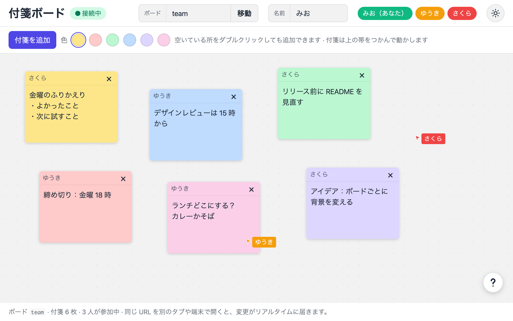

# Sticky board

A real-time sticky-note board, implemented as a metatell worker plugin with its
own React page. Everyone who opens the same board sees notes being added,
dragged, edited, recolored, and deleted as it happens, along with each other's
cursors and who is on the board.



The page and the Worker ship together, the same way as
[`../../templates/simple-api-with-react-frontend`](../../templates/simple-api-with-react-frontend):
the page as Workers Static Assets, the Worker for everything under `/api/`.

## What this shows beyond the template

- **A WebSocket from the plugin's own page.** The page connects to
  `./api/boards/{board}/ws`, resolved against its `<base>` like every other
  request, so it reaches the Worker through the platform's prefix. The socket
  must live under `/api/`, because only those paths run the Worker first.
- **One Durable Object per board.** `BoardRoom` is addressed by
  `idFromName(board)`. The handshake cannot be returned from an RPC method, so
  the Worker passes the request to the Durable Object's `fetch`.
- **The hibernation API.** `BoardRoom` accepts sockets with `acceptWebSocket`,
  so it can sleep while nobody is typing and stop duration billing. Each
  connection's name and color live in its attachment
  (`serializeAttachment`), which survives hibernation, so the list of people is
  rebuilt from the open sockets rather than from memory.
- **Optimistic updates.** Your own moves, edits, and color changes show at once
  and are sent to everyone else; the server echoes only what the sender cannot
  know yet, such as a new note's ID.
- **Throttling.** While dragging, the page sends a position at most every 40 ms
  and the final one on release; cursors at most every 50 ms; typing every
  250 ms and on blur.
- **Reconnecting.** A dropped socket is retried after 1, 2, 4… seconds, up to
  10. On reconnect the server sends the board again, so nothing is lost.

## Using it

Open `/ext/{organizationId}/`. The board's name is in the URL hash
(`#lobby` by default), so sharing the URL shares the board. Open it in two
tabs or on two devices to see the updates.

- Add a note with "付箋を追加" or by double-clicking an empty spot.
- Drag a note by its top bar; recolor it from the swatches there; delete it
  with ×.
- Set your name at the top. It is not saved: the page does not keep text you
  type in browser storage, so reopening it starts you as a guest again.
- Switch between the light and dark theme with the button at the top right.
  The page follows the system setting until you switch, then keeps your choice
  under `worker-plugin:sticky-board:theme`.
- Open ? at the bottom right for how the board works, how to use it, and a
  link to this source on GitHub.

Unlike the templates' advice, the theme's key is not prefixed with the
organization ID: the page could only read it from the URL, which anyone can
choose. So the theme is shared by every organization's sticky board in the same
browser. It is checked to be `light` or `dark` when read.

A note touched by someone else is outlined in their color for a moment, with
their name on it.

## Protocol

Every message is JSON with a `type`. The types are in
[`worker/src/protocol.ts`](./worker/src/protocol.ts), shared by the Worker and
the page.

| From | Type | Meaning |
| --- | --- | --- |
| Page | `note.add` | Add a note at `x`, `y` with a color |
| Page | `note.move`, `note.edit`, `note.color` | Change a note |
| Page | `note.delete` | Delete a note |
| Page | `cursor` | Move your cursor |
| Page | `rename` | Change your name |
| Server | `welcome` | Sent on connect: who you are, every note, everyone else |
| Server | `note.upserted`, `note.deleted` | A note changed, and who changed it |
| Server | `peer.joined`, `peer.updated`, `peer.left` | Someone joined, renamed, or left |
| Server | `cursor` | Someone's cursor moved |
| Server | `error` | Your last message was rejected |

The server clamps positions to the board (2400 × 1400), keeps notes to 500
characters and 200 per board, and accepts only the six note colors.

## Routes

| Method | Path | Result |
| --- | --- | --- |
| `GET` | `/api/boards/{board}/ws` | The WebSocket. `{board}` is lowercase letters, digits and hyphens, up to 32; `?name=` sets your name |

Anyone who can reach the URL can join and edit a board. To check the caller,
pass a short-lived token in the query string — browsers cannot set headers on
a WebSocket handshake — and verify it as in
[`../../templates/simple-api-with-token-verification`](../../templates/simple-api-with-token-verification).

## Commands

Run these at the root:

```bash
pnpm install
pnpm dev            # wrangler dev on :8787, rebuilding the page as you edit
pnpm lint:tsc       # typecheck both packages
pnpm build          # writes dist/plugin.zip
```

Open `http://localhost:8787/#lobby` in two tabs to try it locally.
